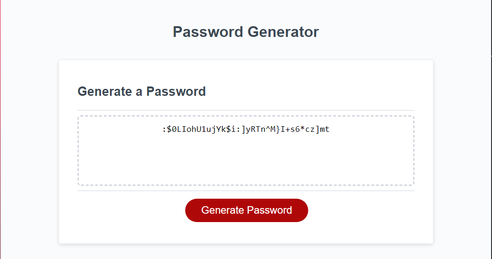

# Password Generator

This is a simple JavaScript-based password generator that allows users to create secure passwords based on certain criteria.

## Usage

To use the password generator, follow these steps:

1. Click the "Generate Password" button.
2. You will be prompted to enter the desired length of the password (between 8 and 128 characters).
3. Confirm which criteria to include in the password: lowercase characters, uppercase characters, numeric characters, and/or special characters.
4. After answering the prompts, a password matching the selected criteria will be generated and displayed in the designated input field.

## Criteria

- Password length: Between 8 and 128 characters.
- Character types: Include lowercase, uppercase, numeric, and/or special characters.

## Technologies Used

- HTML
- CSS
- JavaScript

## How It Works

The application uses JavaScript to prompt the user for password criteria, validate the input, and generate a random password based on the selected criteria.

## How It Looks

## Installation

No installation is required. Simply open the HTML file in a web browser.

## License

This project is licensed under the MIT License - see the [LICENSE](LICENSE) file for details.

## Acknowledgments

- [OWASP Foundation](https://www.owasp.org/) - For the list of password special characters.
